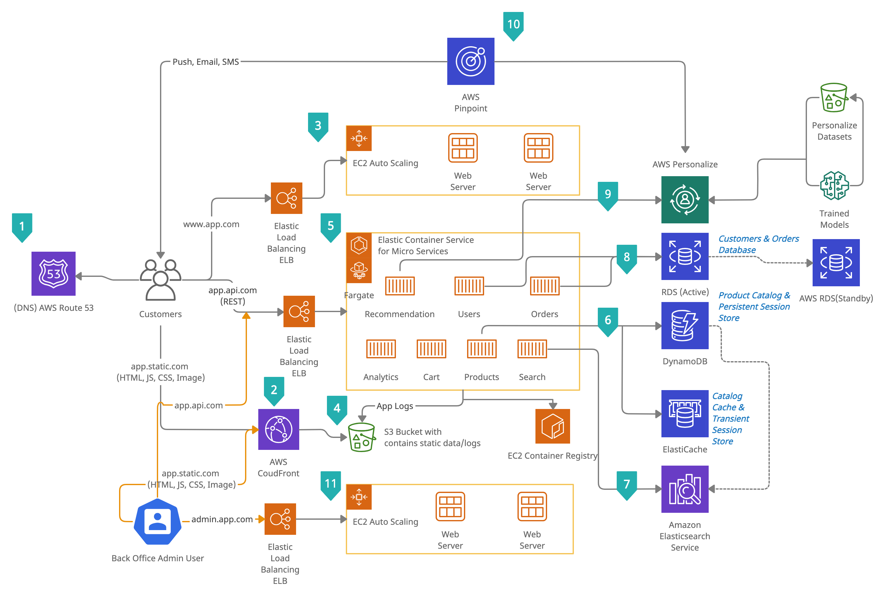

#  Question 1: e-commerce application architecture on AWS cloud
## Introduction
Maintaining an e-commerce website with a large product catalog and global customer base can be challenging. The catalog should be searchable, and individual product pages should contain a rich information set that includes, for example, images, a PDF manual, and customer reviews.

Customers want to find the products they are interested in quickly, and they expect pages to load quickly. Worldwide customers want to be able to make purchases at any time, so the website should be highly available. Meeting these challenges becomes harder as your catalog and customer base grow.
With the tools that AWS provides, you can build a compelling, scalable website with a searchable product catalog that is accessible with very low latency.

At the heart of this architecture is a collection of polyglot microservices hosted in [Amazon Elastic Container Service](https://aws.amazon.com/ecs/) ([AWS Fargate](https://aws.amazon.com/fargate/)) that represent domain constructs such as `products`, `carts`, `orders`, and `users` as well as services for `search` and `recommendations`. 
While the both the e-commerce frontend application and back-office frontend is hosted EC2 Auto Scaling EC2 cluster environment. Both the frontend application makes the static content and web content served better by leveraging Amazon CloudFront and Amazon S3.

The architecture is supported by several managed services including [AWS RDS](https://aws.amazon.com/rds/), [Amazon DynamoDB](https://aws.amazon.com/dynamodb/),[Amazon ElastiCache](https://aws.amazon.com/elasticache/), [Amazon Elasticsearch Service](https://aws.amazon.com/elasticsearch-service/), [Amazon Pinpoint](https://aws.amazon.com/pinpoint/) and [Amazon Personalize](https://aws.amazon.com/personalize/)
## AWS e-commerce Reference Architecture

## System Overview

1. `Amazon Route 53` : DNS requests to the e-commerce website are handled
by Amazon Route 53, a highly available Domain Name
System (DNS) service.
2. `Amazon CloudFront` : is a content distribution network
(CDN) with edge locations around the globe. It can
cache static and streaming content and deliver dynamic
content with low latency from locations close to the customer.
3. `e-commerce frontend application` : The e-commerce frontend application is deployed by AWS
EC2 Auto Scaling, which automatically handles the
details of capacity provisioning, load balancing, auto scaling,
and application health monitoring.
4. `Amazon S3`:  Amazon S3 stores all static catalog content, such as product images,
manuals, and videos, as well as all log files of the Microservices (No: 5) and clickstream
information from Amazon CloudFront .
5. `Polyglot microservices` : At the heart of this architecture is a collection of polyglot microservices hosted in [Amazon Elastic Container Service](https://aws.amazon.com/ecs/) ([AWS Fargate](https://aws.amazon.com/fargate/)) 
that represent domain constructs such as `products`, `carts`, `orders`, and `users` as well as services for `search` and `recommendations`. 
6. `Amazon DynamoDB` : Amazon DynamoDB is a fully-managed, high
performance, NoSQL database service that is easy to
set up, operate, and scale. It is used both as a session store
for persistent session data, such as the shopping cart, and as
the product database. Because DynamoDB does not have a
schema, we have a great deal of flexibility in adding new
product categories and attributes to the catalog.

   `Amazon ElastiCache`: Amazon ElastiCache is used as a session store for
volatile data and as a caching layer for the product
catalog to reduce I/O (and cost) on DynamoDB.
7. `Amazon Elastic Service` : Product catalog data is loaded into Amazon
Elastic Search Index, Elastic Search service that
provides fast and highly scalable search functionality.
8. `Amazon RDS` : To provide high availability, the user and orders
databases are hosted redundantly on a multi-AZ (multi
Availability Zone) deployment of Amazon Relational
Database Service (Amazon RDS)within private subnets that
are isolated from the public Internet.
9. `Amazon Personalize` : Amazon Personalize to provide similar item recommendations, search re-ranking based on user preferences, and product recommendations based on user item interactions.
10. `Amazon Pinpoint` : Amazon Pinpoint to add the ability to dynamically send welcome messages, abandoned cart messages, and messages with personalized product recommendations to the customers.
11. `Back office frontend application` : The back office frontend application is deployed by AWS
EC2 Auto Scaling, which automatically handles the
details of capacity provisioning, load balancing, auto scaling,
and application health monitoring.
