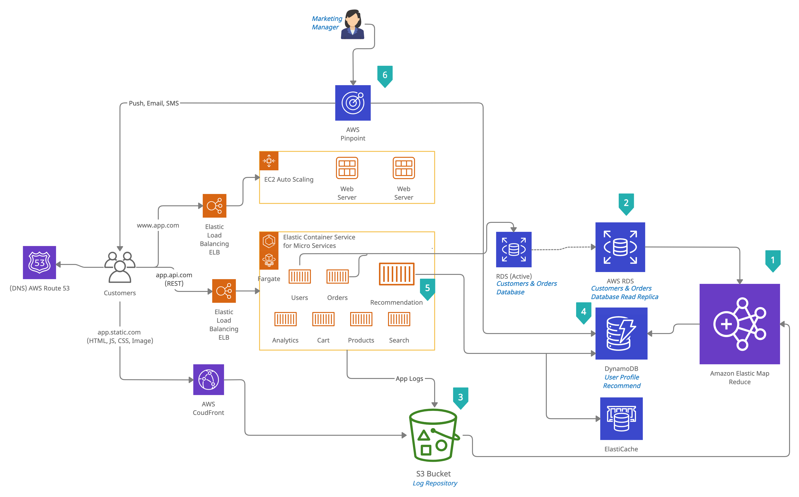

#  Question 2: e-commerce recommendation architecture on AWS cloud
## Introduction
To offer personalized product recommendations to customers who are browsing your e-commerce site.In order to build such a service, you have to process very large
amounts of data from multiple data sources. The resulting user profile information has to be available to deliver real-time product recommendations on the e-commerce website.

## AWS e-commerce Reference Architecture

## Data Pipeline Overview

1. `Amazon Elastic MapReduce (Amazon EMR)` : Amazon EMR is a
hosted Hadoop framework that runs on Amazon Elastic
Compute Cloud (Amazon EC2) instances. It aggregates and
processes user data from server log files and from the
customer´s purchase history.
2. `Amazon RDS of customer and order databases` : Amazon Relational Database Services (Amazon
RDS) Read Replica of customer and order databases is
used by Amazon EMR to compute user profiles.
3. `AWS S3 Log Repo` : Log files produced by the e-commerce services 
have been stored on Amazon S3 and are consumed by the Amazon EMR cluster
to compute user profiles and actions.
4. `Amazon DynamoDB `:  User profile recommendations information generated by the Amazon EMR
cluster is stored in Amazon DynamoDB, a scalable,
high-performance managed NoSQL database that can serve
recommendations with low latency. `Amazon ElastiCache` is used as a caching layer for the product
recommendation to reduce I/O (and cost) on DynamoDB.
5. `Recommendation  Microservices` : A recommendation micro service used by the web front
end is hosted in [Amazon Elastic Container Service](https://aws.amazon.com/ecs/) ([AWS Fargate](https://aws.amazon.com/fargate/)) . This
service uses the profile information stored on Amazon
DynamoDB to provide personalized recommendations to be shown on the e-commerce web front end.

6. `Amazon Pinpoint` :  Amazon Pinpoint is being used by marketing
managers to send targeted email campaigns to customers
with specific user profiles that is read from the recommendations Amazon DynamoDB content.
