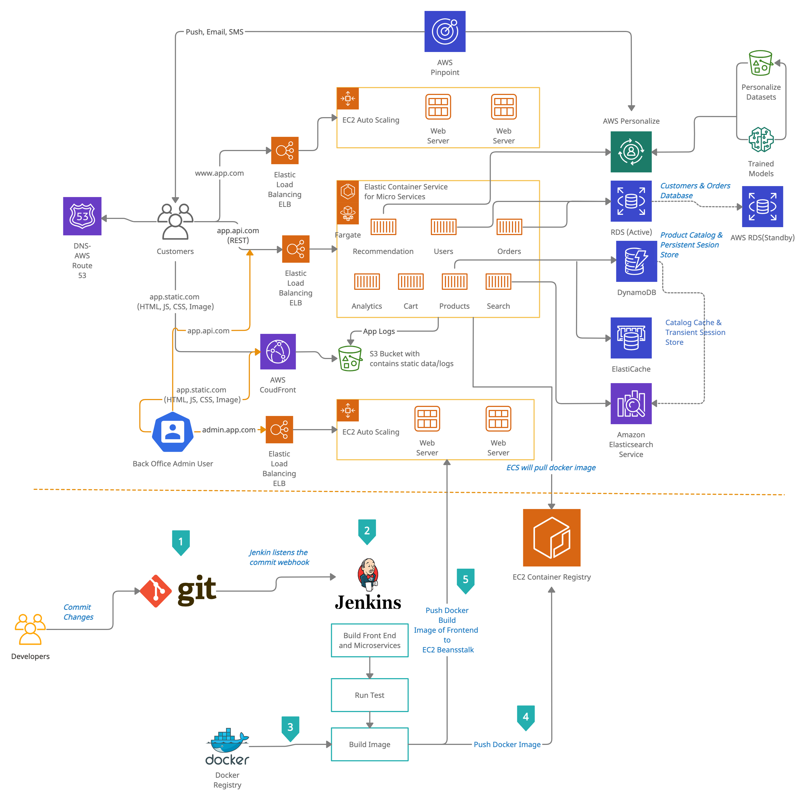

#  Question 3: CI/CD for e-commerce  application in AWS platform
## Introduction

AWS EC2 Container Service (ECS) is a highly scalable container management service which is used to start, stop and run microservices 
within Docker containers on a cluster of AWS EC2 instances. In this architecture, it is demonstrated as to how to deploy container-based microservices using CLI commands from within Jenkins.

## Reference Architecture

## CI/CD  Pipeline Overview

1. `Git` : Developer will commit code changes to git and Webhook configured in GitLab triggers the Jenkins job.
2. `Jenkin Build` : Jenkins job starts executing which results in following steps:

    A. Retrieve the microservice/ frontend application artifacts from Gitlab
    
    B. Build the microservice and frontend
    
    C. Run the tests such as unit and integration tests
    
    D. Build the image if all of the above steps are successful
    
    E.Push the image to image repository to AWS ECR
    
    F. Register task definition with AWS ECS
    
    G. Update AWS ECS
    
3. `Docker Image` : Use docker registry for building the docker image.
4. `Amazon Elastic Container Registry `:  Amazon Elastic Container Registry (ECR) is a fully managed container registry that makes it easy to store, manage, share, and deploy the container images and artifacts anywhere.
Amazon ECR works with  Amazon Elastic Container Service (ECS) by simplifying the development to production workflow, and AWS Fargate for one-click deployments. 

5. `Deploy the frontend to EC2 Beanstalk` : after building the frontend docker image for both e-commerce app and back-office app we can push the docker image to EC2 Beanstalk  
